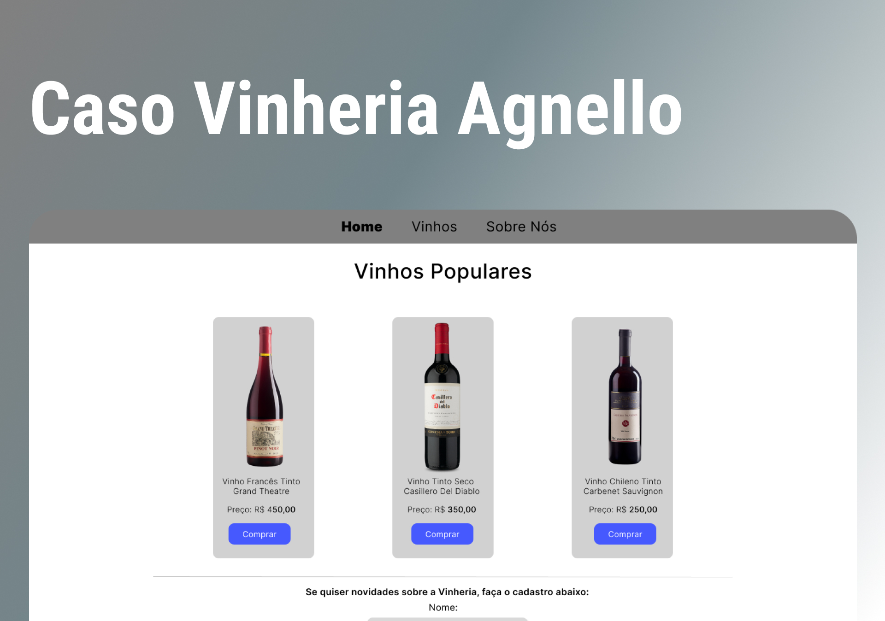

# Caso Vinheria Agnello

## Descrição

O Caso Vinheria Agnello é um projeto que busca ajudar uma vinícola brasileira a se adaptar aos tempos de pandemia, oferecendo uma solução de e-commerce que preserve a essência da empresa e proporcione uma experiência de compra agradável e intuitiva para seus clientes. Com uma gestão tradicional, a Vinheria Agnello resistiu por muito tempo à ideia de entrar no mundo do comércio eletrônico, mas agora está disposta a investir em um portal de vendas online para minimizar o impacto negativo da pandemia em seus negócios.

O objetivo do projeto é desenvolver um portal que destaque a vasta gama de rótulos de vinícolas nacionais e internacionais disponíveis na Vinheria Agnello, oferecendo informações sobre as características de cada tipo de uva, região, vinícola ou rótulo de vinho, sugerindo harmonizações e adequando os vinhos às diferentes ocasiões de consumo. Com a implementação do e-commerce, a Vinheria Agnello espera alcançar novos clientes em todo o país e continuar oferecendo uma experiência de compra única e personalizada aos seus clientes.

## Tabela de Conteúdos

- [Tecnologias](#tecnologias)
- [Projeto](#projeto)
- [Layout](#layout)
- [Rodar Código](#como-rodar-o-código-na-sua-máquina)

## 🚀 Tecnologias

Esse projeto foi desenvolvido com as seguintes tecnologias:

- HTML
- CSS
- Figma
- Git
- GitHub

## 💻 Projeto

Desenvolvimento de um portal de e-commerce para a Vinheria Agnello, a fim de minimizar o impacto da pandemia nos negócios da vinícola e permitir que os clientes comprem seus vinhos online de forma segura e intuitiva.

## 🔖 Layout

Você pode visualizar o layout do projeto através [DESSE LINK](https://www.figma.com/file/tAAnnDmN3aHb2MXMnzwwzW/Caso-da-Vinheria-Agnello?type=design&node-id=3%3A12&t=VtErXQCJXP3ZnYMD-1). É necessário ter conta no [Figma](https://figma.com) para acessá-lo.

## Como rodar o código na sua máquina

To run this code in your machines follow the steps below:

- run in your terminal: git clone https://github.com/Sarah-Ribeiro/caso-vinheria-agnello

- Then go to the folder: cd caso-vinheria-agnello

- Run the live server in the index.html

- HAVE FUN!

---

Feito com ♥ by Sarah Ribeiro
